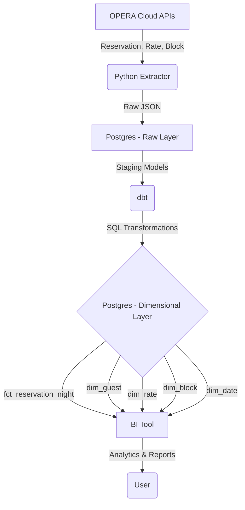

## Summary
This document outlines the requirements for the `booking-core` feature of the ErasOpera project. This feature will extract, transform, and model core booking-related data from the Oracle OPERA Cloud API into a Kimball-style dimensional model. The resulting data warehouse will empower stakeholders like revenue managers and data analysts to perform in-depth analysis of booking trends, pacing, and guest behavior.

## User Stories / Jobs To Be Done
- **As a revenue manager, I want to** analyze booking pace by market segment and lead time, **so that I can** adjust pricing and availability controls to maximize revenue.
- **As a hotel general manager, I want to** see daily, weekly, and monthly reservation activity (new bookings, cancellations, modifications), **so that I can** understand business on the books and forecast occupancy.
- **As a data analyst, I want to** join reservation data with guest and property dimensions, **so that I can** build reports on guest stay patterns and property performance.
- **As a hotel owner, I want to** see headline KPIs on a single dashboard, **so that I can** quickly assess the property's booking performance at a glance.
- **As a marketing manager, I want to** identify guests who book specific rate codes or packages, **so that I can** target them with relevant offers.

## What The User Wants (Behavioral Outcomes)
- A set of fact and dimension tables in the PostgreSQL data warehouse representing the core booking entities.
- The ability to query `fct_reservation_night` to get a daily record of every night for every reservation.
- The ability to slice and dice reservation data by conformed dimensions like `dim_date`, `dim_property`, `dim_guest`, and `dim_rate`.
- Historical tracking of changes to key guest attributes (e.g., address) within `dim_guest` using Type 2 Slowly Changing Dimensions.
- Data in the warehouse should be refreshable from the OPERA Cloud API on a scheduled basis.

## Flow / State Diagram
This diagram shows the high-level data flow for the `booking-core` feature.

## Data Warehouse Structure
The data warehouse will be organized in PostgreSQL using a three-schema structure to ensure a clear separation of concerns and data lineage:
-   **`raw`**: This schema will store the raw, unmodified JSON responses directly from the OPERA Cloud APIs. This provides a durable source of truth and allows for reprocessing without re-fetching from the source.
-   **`staging`**: Data from the `raw` schema is cleaned, typed, and structured into relational tables here. Column names are converted to a consistent `snake_case` format. This layer acts as an intermediate step before loading the final dimensional model.
-   **`production` (or `analytics`)**: This schema holds the final, Kimball-style dimensional model. It contains the fact and dimension tables that are optimized for analytical queries and consumed by BI tools.

## Leadership Dashboard KPIs (for booking-core)
To provide immediate value, the `booking-core` feature will power a V1 leadership dashboard.

**Key Business Questions:**
- How full are we?
- How much are guests paying on average?
- How effective are we at filling the hotel at a good rate?
- What is our overall booking revenue looking like?
- How is booking activity trending?
- How far in advance are guests booking?
- How many bookings are being cancelled?

**Specific KPIs:**
- **Occupancy (estimated):** `(Total Room Nights / (Number of Rooms * Number of Days))`
- **Average Daily Rate (ADR) (estimated):** `(Total Revenue / Number of Room Nights)`
- **Revenue Per Available Room (RevPAR) (estimated):** `(Total Revenue / (Number of Rooms * Number of Days))`
- **Total Revenue (estimated):** `SUM(nightly_rate)` from reservation data.
- **Number of Reservations:** `COUNT(DISTINCT reservation_id)`
- **Number of Room Nights:** `SUM(number_of_nights)` or `COUNT(*)` from `fct_reservation_night`.
- **Average Lead Time:** `AVG(arrival_date - booking_date)`
- **Cancellation Rate:** `(Number of Cancelled Reservations / Total Number of Reservations)`

**Note:** Financial KPIs like ADR, RevPAR, and Total Revenue are considered **estimates** at this stage. They are based on rate plan data pulled with the reservation. They will become fully accurate once the `financials` feature is integrated, which provides access to actual folio-level transactions and charges. Similarly, Occupancy is an estimate until the `operations` feature provides an authoritative source for total room counts.

## Development Roadmap
The project will follow a vertical slice approach, delivering end-to-end value with each major phase.

-   **Phase 1 (This SPEC): Build the `booking-core` Pipeline & Dashboard v1.**
    -   **Goal:** Deliver immediate operational insights.
    -   **Scope:** Implement the full ELT pipeline for the `booking-core` domain, from API extraction to the final dimensional model. Build a V1 dashboard to visualize key operational metrics (reservations, room nights, lead time) and the *estimated* financial KPIs.

-   **Phase 2 (Next): Integrate `financials` Feature.**
    -   **Goal:** Achieve full financial accuracy.
    -   **Scope:** Integrate data from the `financials` domain (folios, transactions, payments). This will replace estimated revenue figures with actual posted revenue, making ADR and RevPAR KPIs fully accurate.

-   **Phase 3 (Following): Integrate `operations` Feature.**
    -   **Goal:** Achieve 100% accurate occupancy calculations.
    -   **Scope:** Integrate data from the `operations` domain (housekeeping, room status). This provides an authoritative source for the total number of physical rooms available, making the denominator in the Occupancy calculation precise.

## Acceptance Criteria (Testable Outcomes)
1.  **The `fct_reservation_night` table contains one row for each night of every active and arrived reservation.**
    -   `proven by:` dbt test comparing `count(*)` from the fact table against a source system report or a control query.
    -   `strategy:` Fully-Automated
2.  **The grain of `fct_reservation_night` is one row per property per reservation per night.**
    -   `proven by:` dbt test checking for duplicates on the composite key (`property_id`, `reservation_id`, `business_date`).
    -   `strategy:` Fully-Automated
3.  **The `dim_guest` dimension is a Type 2 Slowly Changing Dimension, correctly tracking history for guest address changes.**
    -   `proven by:` dbt test that simulates a guest address change and verifies that a new row is inserted with updated `valid_from` and `valid_to` dates, preserving the old record.
    -   `strategy:` Fully-Automated
4.  **The total number of reservation nights in `fct_reservation_night` for a given period matches a daily summary report from the OPERA Cloud source system.**
    -   `proven by:` Manual reconciliation process initially, with a long-term goal of an automated data validation pipeline.
    -   `strategy:` Hybrid
5.  **All primary keys in dimension and fact tables are non-null and unique.**
    -   `proven by:` Standard dbt `unique` and `not_null` tests on all model primary keys.
    -   `strategy:` Fully-Automated
6.  **Foreign key relationships between fact and dimension tables are maintained.**
    -   `proven by:` dbt `relationship` tests ensuring that all foreign keys in fact tables have a corresponding primary key in the dimension table.
    -   `strategy:` Fully-Automated
7.  **The data extraction process correctly filters for updated records using the `lastUpdateDate` timestamp.**
    -   `proven by:` Integration test that updates a record in a mock source, runs the extractor, and verifies the record is pulled and updated in the staging layer.
    -   `strategy:` Fully-Automated

## Out Of Scope
- **Folio-level transactions:** Detailed charge and payment information associated with a reservation will be handled by the `financials` feature. This SPEC only covers the reservation itself.
- **Real-time data synchronization:** The initial implementation will be batch-based, pulling data on a scheduled basis (e.g., hourly or daily).
- **Group and Allotment details:** While Blocks are in scope, detailed management of group wash, pickup, and allotment performance is a separate, future enhancement.
- **Channel and Source of Business analysis:** While the base data may be present, building specific models for channel profitability or source of business attribution is not in the scope of this initial feature.

## Constraints
- The solution must use the approved technology stack: Python for extraction, PostgreSQL for the warehouse, and dbt for transformations.
- Data models must adhere to the Kimball dimensional modeling methodology.
- The primary grain of the core fact table must be the reservation night.
- The extraction process must use the OPERA Cloud REST APIs and their OAuth2 authentication mechanism.
- Change Data Capture (CDC) will be pull-based, relying on `lastUpdateDate` fields in the source API responses.

## Open Questions
- None at this time.

## Background / Research Findings
- The project is greenfield, with no existing application code.
- The source of truth for schemas is the set of Oracle OPERA Cloud OpenAPI specifications located in the `docs/` directory.
- The `booking-core` feature maps to the following OPERA Cloud APIs: Reservation, Reservation Async, Reservation Master Data Mgmt, Rate, Rate Plan Async, Block, Block Config, Block Reservation Async, Channel Config, and Nor1 Upsell.
- Architectural decisions from prior research phases have established a Kimball-style dimensional model with a reservation-night grain for the primary fact table. The SCD strategy is Type 2 for key dimensions, and CDC will be pull-based. These decisions are reflected in the constraints and acceptance criteria.
