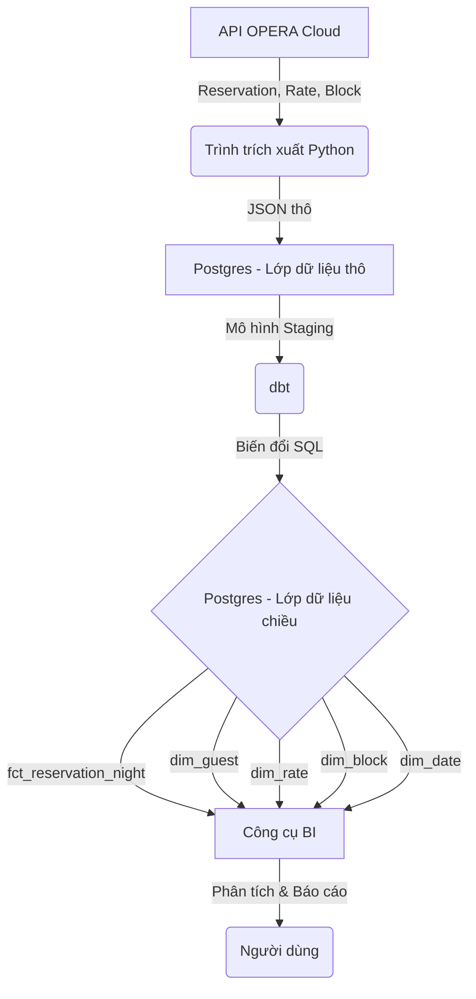

## Tóm tắt
Tài liệu này phác thảo các yêu cầu cho tính năng `booking-core` của dự án ErasOpera. Tính năng này sẽ trích xuất, chuyển đổi và mô hình hóa dữ liệu cốt lõi liên quan đến đặt phòng từ API Oracle OPERA Cloud thành một mô hình chiều (dimensional model) theo phong cách Kimball. Kho dữ liệu kết quả sẽ cho phép các bên liên quan như quản lý doanh thu và nhà phân tích dữ liệu thực hiện phân tích sâu về xu hướng đặt phòng, tốc độ đặt phòng và hành vi của khách.

## Câu chuyện người dùng / Công việc cần làm
- **Với vai trò là một quản lý doanh thu, tôi muốn** phân tích tốc độ đặt phòng theo phân khúc thị trường và thời gian đặt trước, **để tôi có thể** điều chỉnh giá và các kiểm soát về phòng trống để tối đa hóa doanh thu.
- **Với vai trò là một tổng quản lý khách sạn, tôi muốn** xem hoạt động đặt phòng hàng ngày, hàng tuần và hàng tháng (đặt phòng mới, hủy, sửa đổi), **để tôi có thể** hiểu được tình hình kinh doanh và dự báo công suất phòng.
- **Với vai trò là một nhà phân tích dữ liệu, tôi muốn** kết nối dữ liệu đặt phòng với các chiều (dimension) về khách và cơ sở lưu trú, **để tôi có thể** xây dựng báo cáo về các mẫu lưu trú của khách và hiệu suất của cơ sở lưu trú.
- **Với vai trò là một chủ khách sạn, tôi muốn** xem các chỉ số KPI chính trên một bảng điều khiển duy nhất, **để tôi có thể** nhanh chóng đánh giá hiệu suất đặt phòng của cơ sở lưu trú.
- **Với vai trò là một quản lý tiếp thị, tôi muốn** xác định những khách hàng đặt các mã giá hoặc gói dịch vụ cụ thể, **để tôi có thể** nhắm mục tiêu họ với các ưu đãi phù hợp.

## Điều người dùng mong muốn (Kết quả hành vi)
- Một tập hợp các bảng fact và dimension trong kho dữ liệu PostgreSQL đại diện cho các thực thể đặt phòng cốt lõi.
- Khả năng truy vấn `fct_reservation_night` để có được bản ghi hàng ngày của mỗi đêm cho mỗi lượt đặt phòng.
- Khả năng cắt và chia nhỏ dữ liệu đặt phòng theo các chiều phù hợp như `dim_date`, `dim_property`, `dim_guest`, và `dim_rate`.
- Theo dõi lịch sử các thay đổi đối với các thuộc tính chính của khách (ví dụ: địa chỉ) trong `dim_guest` bằng cách sử dụng Type 2 Slowly Changing Dimensions.
- Dữ liệu trong kho phải có thể làm mới từ API OPERA Cloud theo lịch trình.

## Sơ đồ luồng / Trạng thái
Sơ đồ này cho thấy luồng dữ liệu cấp cao cho tính năng `booking-core`.

## Cấu trúc Kho dữ liệu
Kho dữ liệu sẽ được tổ chức trong PostgreSQL bằng cấu trúc ba schema để đảm bảo sự tách biệt rõ ràng về chức năng và dòng dõi dữ liệu:
-   **`raw`**: Schema này sẽ lưu trữ các phản hồi JSON thô, không sửa đổi trực tiếp từ các API OPERA Cloud. Điều này cung cấp một nguồn dữ liệu xác thực bền vững và cho phép xử lý lại mà không cần lấy lại từ nguồn.
-   **`staging`**: Dữ liệu từ schema `raw` được làm sạch, định kiểu và cấu trúc thành các bảng quan hệ tại đây. Tên cột được chuyển đổi sang định dạng `snake_case` nhất quán. Lớp này hoạt động như một bước trung gian trước khi tải mô hình chiều cuối cùng.
-   **`production` (hoặc `analytics`)**: Schema này chứa mô hình chiều cuối cùng theo phong cách Kimball. Nó chứa các bảng fact và dimension được tối ưu hóa cho các truy vấn phân tích và được sử dụng bởi các công cụ BI.

## Các chỉ số KPI trên Bảng điều khiển Lãnh đạo (cho booking-core)
Để cung cấp giá trị ngay lập tức, tính năng `booking-core` sẽ cung cấp dữ liệu cho Bảng điều khiển lãnh đạo phiên bản 1.

**Các câu hỏi kinh doanh chính:**
- Công suất phòng của chúng ta đang ở mức nào?
- Khách hàng đang trả trung bình bao nhiêu?
- Chúng ta lấp đầy khách sạn với mức giá tốt hiệu quả đến đâu?
- Doanh thu tổng thể từ đặt phòng của chúng ta trông như thế nào?
- Hoạt động đặt phòng đang có xu hướng ra sao?
- Khách hàng đang đặt phòng trước bao xa?
- Có bao nhiêu lượt đặt phòng bị hủy?

**Các chỉ số KPI cụ thể:**
- **Công suất phòng (ước tính):** `(Tổng số đêm phòng đã bán / (Tổng số phòng * Số ngày))`
- **Giá phòng trung bình hàng ngày (ADR) (ước tính):** `(Tổng doanh thu / Tổng số đêm phòng đã bán)`
- **Doanh thu trên mỗi phòng có sẵn (RevPAR) (ước tính):** `(Tổng doanh thu / (Tổng số phòng * Số ngày))`
- **Tổng doanh thu (ước tính):** `SUM(nightly_rate)` từ dữ liệu đặt phòng.
- **Số lượng đặt phòng:** `COUNT(DISTINCT reservation_id)`
- **Số lượng đêm phòng:** `SUM(number_of_nights)` hoặc `COUNT(*)` từ `fct_reservation_night`.
- **Thời gian đặt trước trung bình:** `AVG(arrival_date - booking_date)`
- **Tỷ lệ hủy phòng:** `(Số lượng đặt phòng đã hủy / Tổng số lượng đặt phòng)`

**Lưu ý:** Các chỉ số KPI tài chính như ADR, RevPAR và Tổng doanh thu được coi là **ước tính** ở giai đoạn này. Chúng dựa trên dữ liệu từ kế hoạch giá được lấy cùng với lượt đặt phòng. Chúng sẽ trở nên hoàn toàn chính xác sau khi tính năng `financials` được tích hợp, cung cấp quyền truy cập vào các giao dịch và khoản phí thực tế ở cấp hóa đơn (folio). Tương tự, Công suất phòng là một ước tính cho đến khi tính năng `operations` cung cấp một nguồn có thẩm quyền về tổng số phòng.

## Lộ trình phát triển
Dự án sẽ theo phương pháp lát cắt dọc (vertical slice), cung cấp giá trị từ đầu đến cuối trong mỗi giai đoạn chính.

-   **Giai đoạn 1 (SPEC này): Xây dựng quy trình `booking-core` & Bảng điều khiển v1.**
    -   **Mục tiêu:** Cung cấp thông tin chi tiết về hoạt động ngay lập tức.
    -   **Phạm vi:** Thực hiện toàn bộ quy trình ELT cho miền `booking-core`, từ trích xuất API đến mô hình chiều cuối cùng. Xây dựng một bảng điều khiển V1 để trực quan hóa các chỉ số hoạt động chính (đặt phòng, đêm phòng, thời gian đặt trước) và các chỉ số KPI tài chính *ước tính*.

-   **Giai đoạn 2 (Tiếp theo): Tích hợp tính năng `financials`.**
    -   **Mục tiêu:** Đạt được độ chính xác tài chính đầy đủ.
    -   **Phạm vi:** Tích hợp dữ liệu từ miền `financials` (hóa đơn, giao dịch, thanh toán). Điều này sẽ thay thế các số liệu doanh thu ước tính bằng doanh thu thực tế đã ghi nhận, làm cho các chỉ số KPI ADR và RevPAR hoàn toàn chính xác.

-   **Giai đoạn 3 (Sau đó): Tích hợp tính năng `operations`.**
    -   **Mục tiêu:** Đạt được tính toán công suất phòng chính xác 100%.
    -   **Phạm vi:** Tích hợp dữ liệu từ miền `operations` (buồng phòng, tình trạng phòng). Điều này cung cấp một nguồn có thẩm quyền về tổng số phòng vật lý có sẵn, làm cho mẫu số trong phép tính Công suất phòng trở nên chính xác.

## Tiêu chí chấp nhận (Kết quả có thể kiểm thử)
1.  **Bảng `fct_reservation_night` chứa một hàng cho mỗi đêm của mỗi lượt đặt phòng đang hoạt động và đã đến.**
    -   `chứng minh bằng:` kiểm thử dbt so sánh `count(*)` từ bảng fact với một báo cáo từ hệ thống nguồn hoặc một truy vấn kiểm soát.
    -   `chiến lược:` Hoàn toàn tự động
2.  **Độ chi tiết (grain) của `fct_reservation_night` là một hàng cho mỗi cơ sở lưu trú, mỗi lượt đặt phòng, mỗi đêm.**
    -   `chứng minh bằng:` kiểm thử dbt kiểm tra các bản ghi trùng lặp trên khóa tổng hợp (`property_id`, `reservation_id`, `business_date`).
    -   `chiến lược:` Hoàn toàn tự động
3.  **Chiều `dim_guest` là một Type 2 Slowly Changing Dimension, theo dõi chính xác lịch sử thay đổi địa chỉ của khách.**
    -   `chứng minh bằng:` kiểm thử dbt mô phỏng việc thay đổi địa chỉ của khách và xác minh rằng một hàng mới được chèn vào với ngày `valid_from` và `valid_to` được cập nhật, đồng thời bảo tồn bản ghi cũ.
    -   `chiến lược:` Hoàn toàn tự động
4.  **Tổng số đêm đặt phòng trong `fct_reservation_night` cho một khoảng thời gian nhất định khớp với báo cáo tóm tắt hàng ngày từ hệ thống nguồn OPERA Cloud.**
    -   `chứng minh bằng:` Quy trình đối chiếu thủ công ban đầu, với mục tiêu dài hạn là một quy trình xác thực dữ liệu tự động.
    -   `chiến lược:` Hỗn hợp
5.  **Tất cả các khóa chính trong các bảng dimension và fact đều không rỗng và là duy nhất.**
    -   `chứng minh bằng:` các kiểm thử `unique` và `not_null` tiêu chuẩn của dbt trên tất cả các khóa chính của mô hình.
    -   `chiến lược:` Hoàn toàn tự động
6.  **Các mối quan hệ khóa ngoại giữa các bảng fact và dimension được duy trì.**
    -   `chứng minh bằng:` các kiểm thử `relationship` của dbt đảm bảo rằng tất cả các khóa ngoại trong bảng fact đều có một khóa chính tương ứng trong bảng dimension.
    -   `chiến lược:` Hoàn toàn tự động
7.  **Quá trình trích xuất dữ liệu lọc chính xác các bản ghi đã cập nhật bằng cách sử dụng dấu thời gian `lastUpdateDate`.**
    -   `chứng minh bằng:` Kiểm thử tích hợp cập nhật một bản ghi trong một nguồn giả lập, chạy trình trích xuất và xác minh bản ghi được lấy và cập nhật trong lớp staging.
    -   `chiến lược:` Hoàn toàn tự động

## Ngoài phạm vi
- **Giao dịch cấp hóa đơn (Folio-level):** Thông tin chi tiết về phí và thanh toán liên quan đến một lượt đặt phòng sẽ được xử lý bởi tính năng `financials`. SPEC này chỉ bao gồm bản thân lượt đặt phòng.
- **Đồng bộ hóa dữ liệu thời gian thực:** Việc triển khai ban đầu sẽ dựa trên xử lý theo lô (batch-based), lấy dữ liệu theo lịch trình (ví dụ: hàng giờ hoặc hàng ngày).
- **Chi tiết về nhóm và allotment:** Mặc dù Block nằm trong phạm vi, việc quản lý chi tiết về group wash, pickup và hiệu suất allotment là một cải tiến riêng biệt trong tương lai.
- **Phân tích kênh và nguồn kinh doanh:** Mặc dù dữ liệu cơ sở có thể có sẵn, việc xây dựng các mô hình cụ thể cho lợi nhuận kênh hoặc phân bổ nguồn kinh doanh không nằm trong phạm vi của tính năng ban đầu này.

## Các ràng buộc
- Giải pháp phải sử dụng bộ công nghệ đã được phê duyệt: Python để trích xuất, PostgreSQL cho kho dữ liệu và dbt cho các phép biến đổi.
- Các mô hình dữ liệu phải tuân thủ phương pháp mô hình hóa chiều Kimball.
- Độ chi tiết chính của bảng fact cốt lõi phải là đêm đặt phòng (reservation night).
- Quá trình trích xuất phải sử dụng các API REST của OPERA Cloud và cơ chế xác thực OAuth2 của chúng.
- Change Data Capture (CDC) sẽ dựa trên việc kéo dữ liệu (pull-based), dựa vào các trường `lastUpdateDate` trong các phản hồi API nguồn.

## Các câu hỏi còn bỏ ngỏ
- Hiện tại không có.

## Bối cảnh / Kết quả nghiên cứu
- Dự án là một dự án mới hoàn toàn (greenfield), chưa có mã nguồn ứng dụng nào.
- Nguồn xác thực cho các schema là tập hợp các đặc tả OpenAPI của Oracle OPERA Cloud nằm trong thư mục `docs/`.
- Tính năng `booking-core` ánh xạ tới các API OPERA Cloud sau: Reservation, Reservation Async, Reservation Master Data Mgmt, Rate, Rate Plan Async, Block, Block Config, Block Reservation Async, Channel Config, và Nor1 Upsell.
- Các quyết định kiến trúc từ các giai đoạn nghiên cứu trước đã thiết lập một mô hình chiều theo phong cách Kimball với độ chi tiết là đêm đặt phòng cho bảng fact chính. Chiến lược SCD là Type 2 cho các chiều chính, và CDC sẽ dựa trên việc kéo dữ liệu. Những quyết định này được phản ánh trong các ràng buộc và tiêu chí chấp nhận.
